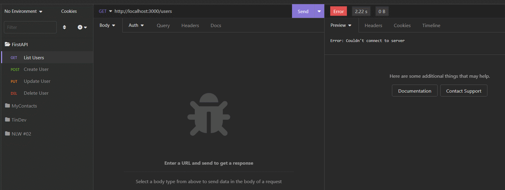

<h1 id="title" align="center">
  FirstAPI 🥇
</h1>

<p align="center">
    
    </img>
    
    
    
    
</p>

## 💻 Detalhes do projeto

Esse projeto faz parte do curso [JStack](https://jstack.com.br/). A ideia é construir um API com node de forma nativa, usando javascript puro, sem o uso de qualquer biblioteca ou framework.

<h1 align="center">
    
</h1>

## 🖧 Rotas da aplicação

| Métodos | Rotas | Descrição |
|---------|-------|-----------|
| GET    | http://localhost:3000/users     | Retorna uma lista de usuários          |
| POST   | http://localhost:3000/users     | Cria um novo usuário                   |
| PUT    | http://localhost:3000/users/:id | Altera o nome do usuário passando o ID |
| DELETE | http://localhost:3000/users/:id | Exclui um usuário passando o ID        |

## :rocket: Tecnologias utilizadas no projeto

As tecnologias/ferramentas utilizadas no projeto foram:

- [JavaScript](https://developer.mozilla.org/en-US/docs/Web/JavaScript)
- [Node.js](https://nodejs.org/)
- [Insomnia](https://insomnia.rest/) *Utilizado para testar os endpoints da aplicação

## 👨🏻‍💻 Lista de ajustes e melhorias

O projeto ainda está em desenvolvimento e as próximas atualizações serão voltadas nas seguintes tarefas listadas abaixo:

- [ ] Criar um mais campos para o usuário (idade, endereço, telefone)
- [ ] Aplicar os metodos de listar, incluir, alterar e excluir para esses campos

## :package: Como utilizar o projeto

É preciso ter instalado no computador o [Git](https://git-scm.com) e o [Node.js](https://nodejs.org/) para rodar o projeto através das linhas de comando. O projeto tem a possibilidade de ser baixado para o computador no formato zip clicando no botão "Code" na opção "Download ZIP".

```bash

    # Clonar o repositório
    $ git clone git@github.com:alexvieirasj/firstapi-app.git

    # Entrar no diretório baixado
    $ cd firstapi-app

    # Iniciar o projeto
    $ node src/index.js 
    
    # running on port 3000 
```

## 🤝 Colaboradores

Lista de pessoas que contribuíram para este projeto:

<table>
  <tr>
    <td align="center">
      <a href="#">
        <br>
        <sub>
          <b>Alex Vieira</b>
        </sub>
      </a>
    </td>
  </tr>
</table>

## 📝 Licença

Esse projeto está sob licença. Veja o arquivo [LICENÇA](LICENSE) para mais detalhes.

[⬆ Voltar ao topo](#title)
